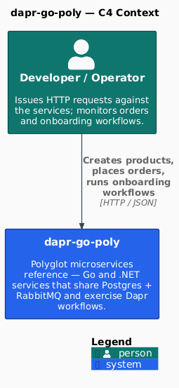
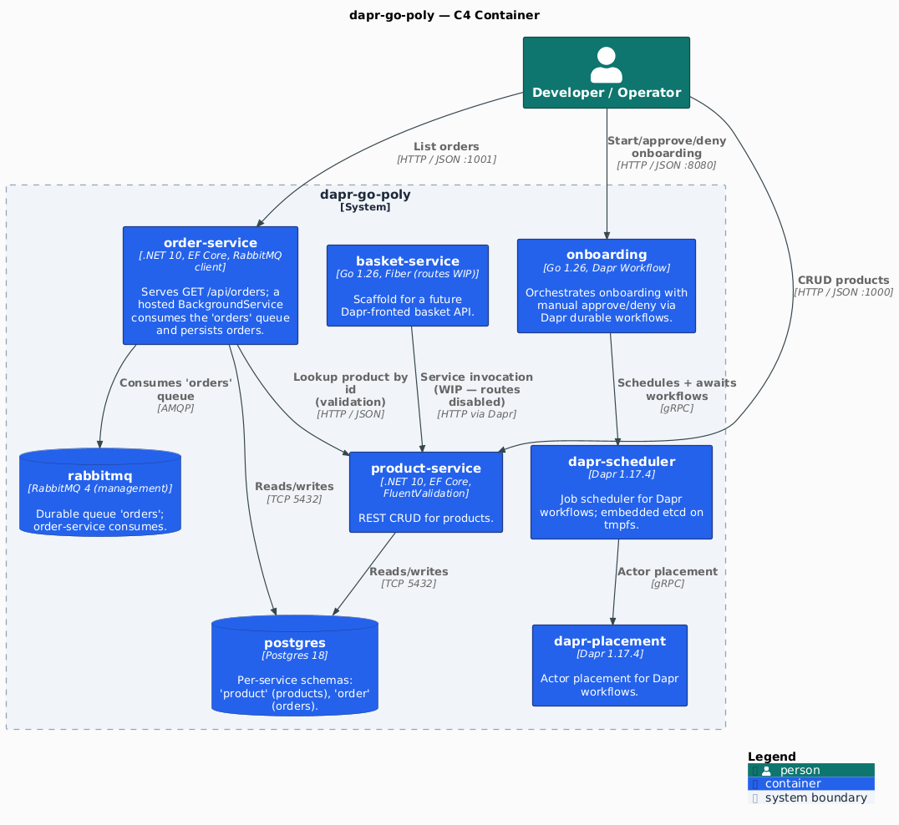

[](https://github.com/AndriyKalashnykov/dapr-go-poly/actions/workflows/ci.yml)
[](https://hits.sh/github.com/AndriyKalashnykov/dapr-go-poly/)
[](https://opensource.org/licenses/MIT)
[](https://app.renovatebot.com/dashboard#github/AndriyKalashnykov/dapr-go-poly)

# Dapr Go Poly

A polyglot microservices project using [Dapr](https://dapr.io/) with Go and .NET services, orchestrated via Docker Compose. Demonstrates service invocation, pub/sub messaging, and state management across multiple language runtimes.

<p align="center"></p>

| Component | Technology | Rationale |
|-----------|-----------|-----------|
| Go services | Go 1.26+ (`basket-service`, `onboarding`) | Low-overhead runtime well suited to sidecar-fronted microservices |
| .NET services | .NET 10 (`order-service`, `product-service`) | LTS runtime with first-class Dapr SDK support |
| Service mesh | Dapr 1.17 (sidecar model) | Decouples service-to-service concerns (invoke, pub/sub, state) from application code |
| Orchestration | Docker Compose (full stack); KinD scaffolding for K8s validation | Compose is the authoritative e2e path; `make e2e-kind` exists for future manifest-level validation |
| Persistence | Postgres 17 (per-service schema), RabbitMQ 3 (order consumer) | Matches the docker-compose local-dev topology one-to-one with production intent |
| Static analysis | `golangci-lint` (gosec/gocritic/errorlint/bodyclose/noctx), `dotnet format --verify`, `govulncheck`, `hadolint`, `trivy fs`, `gitleaks`, `actionlint` | Multi-language gate bundled behind `make static-check`; catches lint, CVEs, secrets, Dockerfile issues, and workflow drift |
| CI | GitHub Actions (`static-check` → `build`/`test`/`integration-test` → `e2e` → `docker` on tag) | Composite `static-check` keeps quality gates in one target; `ci-pass` aggregator simplifies branch protection |
| Local CI | [act](https://github.com/nektos/act) `0.2.87` | Reproduce CI locally; pinned in `.mise.toml` |
| Dependency updates | Renovate (platform automerge) | Single `customManagers` regex tracks every Makefile `# renovate:` comment — no per-tool config drift |

## Quick Start

```bash
make deps              # verify required tools (go, dotnet, docker)
make build             # build all services
make test              # run unit tests (seconds, no Docker)
make integration-test  # integration tests (Testcontainers Postgres + RabbitMQ; requires Docker)
make e2e               # end-to-end tests (full stack via Docker Compose; minutes)
make compose-up        # bring up full stack (postgres + rabbitmq + services + Dapr sidecars)
```

### Test pyramid

| Layer | Target | Speed | Dependencies |
|-------|--------|-------|--------------|
| **Unit** | `make test` | seconds | None — pure Go/FluentValidation logic |
| **Integration** | `make integration-test` | tens of seconds | Testcontainers (Postgres, RabbitMQ); .NET uses [TUnit](https://github.com/thomhurst/TUnit) + `WebApplicationFactory` via `dotnet run` (Microsoft.Testing.Platform). Go integration tests are unit-test shape using a hand-rolled `workflowClient` fake — Dapr sidecar interactions are covered by e2e, not here |
| **E2E** | `make e2e` | ~3–5 min | Self-contained `e2e/docker-compose.e2e.yml` (placement + scheduler + redis + postgres + rabbitmq + product-service + order-service + onboarding + its Dapr sidecar loaded with `e2e/dapr/components/statestore.yaml`). 21 curl-based assertions covering: CRUD + validation on product-service, JSON-array reachability on order-service, RabbitMQ → OrdersConsumer → Postgres async pipeline, onboarding async approve (POST → approve → poll `GET /onboardings/{id}` until `status=Completed`), denial (POST → deny → poll until `status=Failed` + `error` contains `not approved`), and the approve/deny error paths on unknown instance ids (502 from the Dapr sidecar) |

## Prerequisites

| Tool | Version | Purpose |
|------|---------|---------|
| [GNU Make](https://www.gnu.org/software/make/) | 3.81+ | Build orchestration |
| [Git](https://git-scm.com/) | 2.x+ | Source control |
| [Go](https://go.dev/dl/) | 1.26+ | Go services (basket-service, onboarding) |
| [.NET SDK](https://dotnet.microsoft.com/download) | 10.0+ | .NET services (order-service, product-service) |
| [Docker](https://www.docker.com/) | latest | Container builds and Compose orchestration |
| [Dapr CLI](https://docs.dapr.io/getting-started/install-dapr-cli/) | 1.17.1 | Local Dapr runtime (optional) |
| [mise](https://mise.jdx.dev/) | latest | Version manager — installs the CLI toolchain pinned in `.mise.toml` (`make deps` / `make deps-mise`) |
| [kubectl](https://kubernetes.io/docs/tasks/tools/) | matching KinD node image | Required by `make e2e-kind` (optional) |

The CLI toolchain — **act, hadolint, govulncheck, golangci-lint, trivy, gitleaks, actionlint, shellcheck, kind** (and `dapr`) — is pinned in [`.mise.toml`](.mise.toml) and installed by `make deps` (locally) / `jdx/mise-action` (CI). No per-tool install targets to maintain.

Install all required dependencies:

```bash
make deps
```

## Configuration

All operator-tunable values (host ports, container-internal port, Postgres/RabbitMQ
credentials and hosts, database names, Dapr control-plane and sidecar ports, e2e
readiness tuning) are externalized to environment variables with documented defaults
in [`.env.example`](.env.example) — the committed source of truth.

- `docker compose` auto-loads a gitignored `.env` from the project root; copy
  `.env.example` to `.env` and edit to override. Every value is also mirrored as a
  `${VAR:-default}` fallback at its use site, so the stack works with **no `.env`
  present**.
- The `e2e/e2e-test.sh` harness sources `.env.example` then `.env`, so overrides apply
  there too. Host-side curl targets are derived from the host-port vars (e.g.
  `PRODUCT_HOST_PORT`).
- Override host ports to run multiple stacks without collisions, e.g.
  `PRODUCT_HOST_PORT=2000 ORDER_HOST_PORT=2001 make compose-up`.

Third-party image container-internal ports (postgres `5432`, rabbitmq `5672/15672`,
redis `6379`) stay literal on the container side — those are fixed by the image; only
the host-side mapping is tunable.

## Architecture

The Container view (C4 Level 2) shows the four services, their external dependencies (Postgres, RabbitMQ, Dapr placement/scheduler), and the cross-container relationships that matter at runtime.

<p align="center"></p>

Source: [`docs/diagrams/c4-container.puml`](docs/diagrams/c4-container.puml) • [`docs/diagrams/c4-context.puml`](docs/diagrams/c4-context.puml). Render with `make diagrams`; CI drift-checks via `make diagrams-check` (wired into `make static-check`).

A few facts worth surfacing from the Container diagram:

- **Cross-service fan-out:** `order-service` calls `product-service` via a plain `HttpClient` (base URL `PRODUCT_SERVICE_BASE_URL`) — not Dapr service invocation. This is exercised by `OrderValidator` integration tests + the `make e2e` compose suite.
- **Async pipeline:** orders arrive on the RabbitMQ `orders` queue; a hosted `OrdersConsumer` BackgroundService in `order-service` persists them to Postgres. `GET /api/orders` reads the result.
- **Dapr workflows:** `onboarding` is the only service that exercises Dapr durable workflows. Its HTTP API is async — `POST /onboarding` returns 202 with the instance id immediately; `POST /onboardings/{id}/approve` (or `/deny`) raises the external event; `GET /onboardings/{id}` returns the current state, including `result` once completed. Placement + scheduler + an actor-capable state store (Redis, per `e2e/dapr/components/statestore.yaml`) are required for workflow orchestration.
- **`basket-service`** is a scaffold — routes are commented out pending the Dapr service-invocation pattern landing.

### Repository layout

```text
basket-service/                      # Go service (Fiber + Dapr client)
onboarding/                          # Go service (Dapr Workflow)
order-service/                       # .NET service (EF Core + RabbitMQ consumer)
product-service/                     # .NET service (EF Core / Postgres)
order-service.IntegrationTests/      # TUnit + Testcontainers integration tests
product-service.IntegrationTests/    # TUnit + Testcontainers integration tests
e2e/
  docker-compose.e2e.yml             # Self-contained e2e stack (Dapr control plane + Redis + postgres + rabbitmq + 3 app services + onboarding sidecar)
  dapr/components/statestore.yaml    # Dapr state store component (Redis, actorStateStore=true — required by Dapr Workflow)
  e2e-test.sh                        # curl-based e2e assertions (21 total)
dapr-go-poly.slnx                    # .NET solution file (modern XML format)
docker-compose.yml                   # Base: Dapr control plane (placement + scheduler)
global.json                          # .NET SDK version pin
renovate.json                        # Renovate dependency update configuration
```

## Available Make Targets

Run `make help` to see all available targets.

### Build & Run

| Target | Description |
|--------|-------------|
| `make build` | Build all services |
| `make test` | Run unit tests (Go + .NET, fast, no Docker) |
| `make integration-test` | Run integration tests (Testcontainers Postgres + RabbitMQ; requires Docker) |
| `make e2e` | Run end-to-end tests via Docker Compose (postgres + rabbitmq + product/order service; self-contained in `e2e/docker-compose.e2e.yml`) |
| `make clean` | Remove build artifacts |
| `make dapr-run` | Run order-service locally via the Dapr CLI |
| `make update` | Update all dependencies to latest versions |

### Code Quality

| Target | Description |
|--------|-------------|
| `make format` | Auto-fix formatting (Go + .NET) |
| `make lint` | Run linters (golangci-lint + dotnet format --verify + hadolint) |
| `make lint-ci` | Lint GitHub Actions workflows (actionlint + shellcheck) |
| `make vulncheck` | Run vulnerability scanners (govulncheck + dotnet list package --vulnerable) |
| `make trivy-fs` | Trivy filesystem scan (CVEs + secrets + misconfigurations) |
| `make secrets` | Gitleaks scan for leaked secrets in git history |
| `make static-check` | Composite quality gate (check-go-alignment + lint-ci + lint + vulncheck + secrets + trivy-fs + diagrams-check + deps-prune-check) |

### Docker

| Target | Description |
|--------|-------------|
| `make image-build` | Build Docker images |
| `make compose-up` | Start Docker Compose services (rebuild) |
| `make compose-down` | Stop and remove Docker Compose services |

### Kubernetes (scaffolding)

| Target | Description |
|--------|-------------|
| `make kind-up` | Create a KinD cluster and install Dapr (cloud-provider-kind for LoadBalancer IPs) |
| `make kind-down` | Tear down the KinD cluster |
| `make e2e-kind` | K8s e2e scaffolding; see [`e2e/k8s/README.md`](e2e/k8s/README.md) for the manifest TODO list |

### CI

| Target | Description |
|--------|-------------|
| `make ci` | Full local CI pipeline (format, static-check, test, build) |
| `make ci-run` | Run GitHub Actions workflow locally via [act](https://github.com/nektos/act) |

### Utilities

| Target | Description |
|--------|-------------|
| `make help` | List available targets (default) |
| `make deps` | Install the toolchain from `.mise.toml` (idempotent) |
| `make deps-mise` | Install mise itself (user-local, no root required) |
| `make deps-prune` | Remove unused and redundant dependencies |
| `make deps-prune-check` | Verify no prunable dependencies (CI gate) |
| `make release` | Create and push a new tag |
| `make renovate-bootstrap` | Install mise + Node for Renovate |
| `make renovate-validate` | Validate Renovate configuration |

## CI/CD

GitHub Actions runs on every push to `main`, tags `v*`, pull requests, `workflow_call`, and `workflow_dispatch` (manual re-trigger). A `changes` detector job (`dorny/paths-filter`) skips the heavy jobs on doc-only changes (markdown, `docs/**`, license, dotfiles, image assets) while always re-including `CLAUDE.md` and `docs/diagrams/**/*.puml` as code.

| Job | Triggers | Steps |
|-----|----------|-------|
| **changes** | every event | `dorny/paths-filter` — gates heavy jobs on whether code (vs docs) changed |
| **static-check** | code changed | `make static-check` (check-go-alignment + lint-ci + lint + vulncheck + secrets + trivy-fs + diagrams-check + deps-prune-check) |
| **build** | after static-check passes | `make build` |
| **test** | after static-check passes | `make test` (unit) |
| **integration-test** | after static-check passes | `make integration-test` (Testcontainers Postgres + RabbitMQ) |
| **e2e** | after build + test pass | `make e2e` (self-contained Compose: postgres + rabbitmq + services) |
| **docker** | after static-check + build + test | `make image-build` (executes only on tag `v*`) |
| **ci-pass** | aggregator, `if: always()` | Verifies all upstream jobs passed — use as branch-protection required check |

A weekly cleanup workflow removes old workflow runs (retains 7 days, minimum 5 runs **per workflow** so a low-frequency workflow is never fully purged) and prunes caches from deleted branches.

[Renovate](https://docs.renovatebot.com/) keeps dependencies up to date with PR automerge enabled. `customManagers` regexes in `renovate.json` track the Makefile constants annotated with `# renovate:` comments, the `kindest/node` image (tag + digest), and the C4-PlantUML `!include` version — no per-tool config drift. The Go toolchain (mirrored across `go.mod`, `onboarding/Dockerfile`, and `.mise.toml`) is grouped so a patch bump lands in one PR, guarded by `make check-go-alignment`.

## Contributing

Contributions welcome — open a PR.
